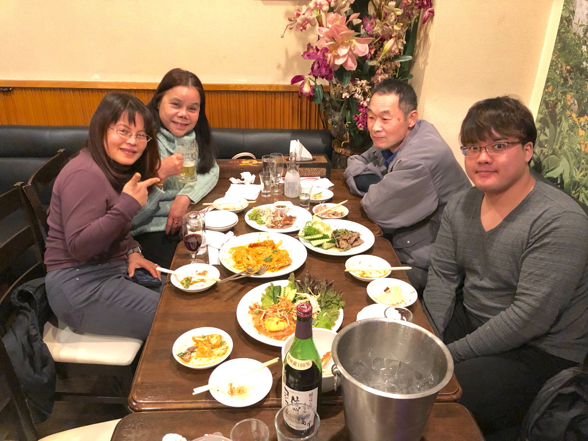
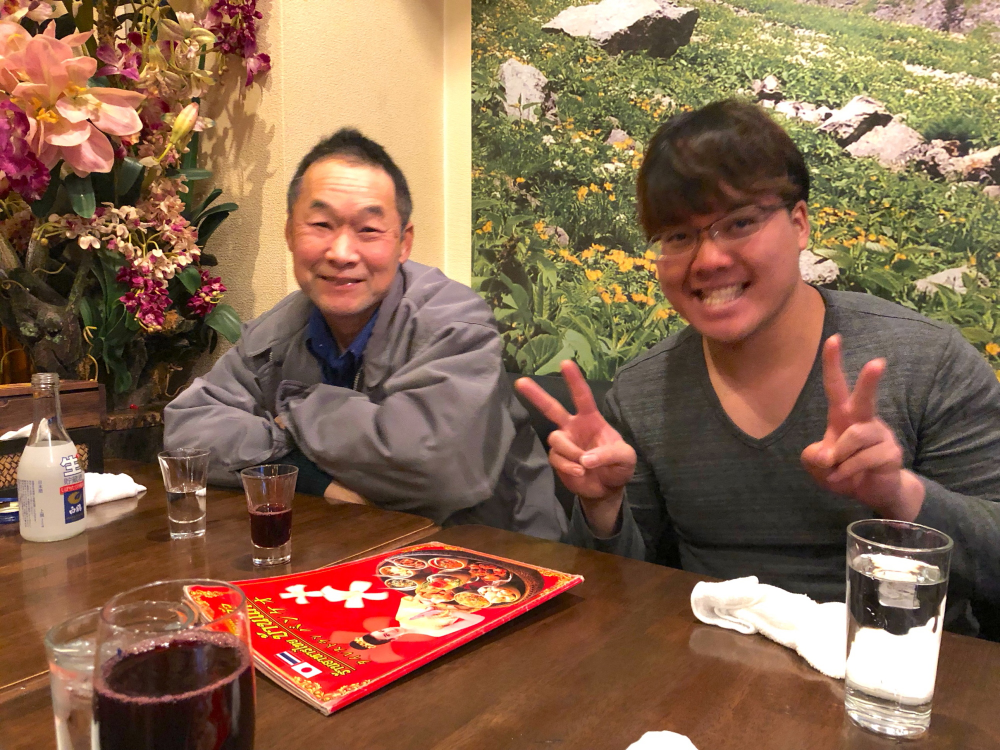
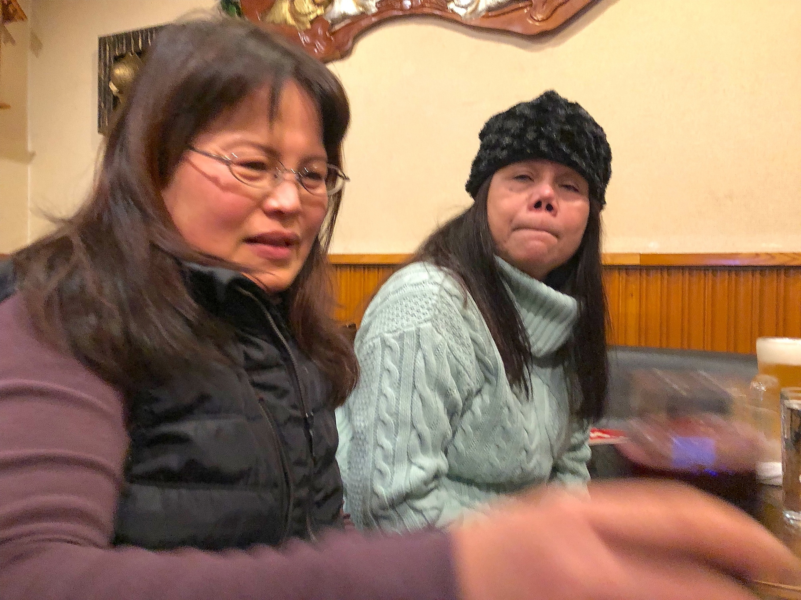

# NYP
<html lang="ja">
 <head>
  <meta charset="utf-8" />
	 

<link href="https://cdnjs.cloudflare.com/ajax/libs/lightbox2/2.7.1/css/lightbox.css" rel="stylesheet">
 
</head>
<body>
<h1><marquee behavior="alternate">!!! 2562年1月12日(土) 新年会＠宇都宮!!!</marquee></h1>

<marquee direction="right" scrollamount="20" width="30%">(^_^)/~hada</marquee>

 

                             

<h3>↓ 画像はクリックで拡大します。スライドショーで閲覧できます。</h3>

  <!--

-->

  
<h4>バンケオ</h4>
<iframe src="https://www.google.com/maps/embed?pb=!1m18!1m12!1m3!1d7435.505953900776!2d139.89497485628303!3d36.560845676010864!2m3!1f0!2f0!3f0!3m2!1i1024!2i768!4f13.1!3m3!1m2!1s0x601f677105a6f933%3A0x69c44ebe9be3294f!2z44OQ44Oz44Kx44Kq!5e0!3m2!1sen!2sjp!4v1564237189022!5m2!1sen!2sjp" width="600" height="450" frameborder="0" style="border:0" allowfullscreen></iframe>
<main>

</main>
                  	
	
	

              

<!-- フッタ -->
 <footer>
 Copyright 2019/01/13 S.Hada
	</footer>
